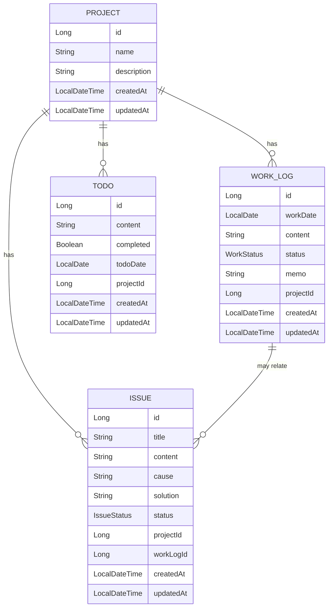

# DevLog MVP 제품 기준

이 문서는 DevLog의 MVP 범위, 기술 기준, API, Entity 관계, 구현 순서를 정의한다. 하네스 문서에 반영할 필요가 있는 항목만 남기고, 구현 중 변할 수 있는 세부 UI 문구나 임시 아이디어는 제외한다.

## 반영 판단

- 반영함: MVP 기능 목록, REST API 목록, Entity 후보와 관계, DTO 분리 원칙, 기술 스택, 프론트엔드 화면 기준, 구현 단계.
- 반영함: 로컬 개인용 앱이라는 제품 경계, 인증/배포/다중 사용자 제외 원칙, Entity 직접 반환 금지, Controller/Service 책임 분리.
- 반영하지 않음: PDF/엑셀 출력, 로그인, JWT, OAuth, Docker, CI/CD, MSA, UI 라이브러리 도입. MVP와 초기 개발 범위를 넓히므로 기본 제외 항목으로만 둔다.
- 반영하지 않음: Soft delete 구현. 초기 삭제는 물리 삭제로 진행하고, 확장 가능성만 설계 고려 사항으로 둔다.

## Product Summary

DevLog는 신입 개발자가 SI/공공기관 프로젝트 업무를 하면서 매일 작성하는 업무 일지, 이슈, 해결 방법, 내일 할 일을 체계적으로 관리하고 주간보고 형태로 정리할 수 있도록 돕는 개인용 웹 애플리케이션이다.

목표는 완성형 배포 서비스가 아니라 로컬에서 실제로 매일 사용할 수 있는 MVP를 먼저 만드는 것이다.

## Non Goals

- 인증, 권한, 로그인, JWT, OAuth.
- 다중 사용자, 팀 협업, 관리자 기능.
- 클라우드 배포, Docker, CI/CD, 인프라, 모니터링.
- MSA 구조, 과한 디자인패턴, 불필요한 추상화.
- 초기 PDF/엑셀 출력.
- 초기 UI 라이브러리 도입.

## Technology Criteria

### Backend

- Java 17.
- Spring Boot.
- Spring Web.
- Spring Data JPA.
- H2 Database 우선 사용.
- Lombok 사용 가능.
- Gradle 사용.

### Frontend

- React.
- Vite.
- Axios.
- CSS는 일반 CSS 또는 CSS Module 사용.
- UI 라이브러리는 처음에는 사용하지 않는다.

### Database

- 초기 개발은 H2로 진행한다.
- 나중에 MySQL로 변경 가능하도록 JPA 기반으로 설계한다.
- 삭제는 처음에는 물리 삭제로 구현해도 된다.
- Soft delete는 나중에 필요하면 확장한다.

## Backend Design Rules

- 패키지는 `domain`, `repository`, `service`, `controller`, `dto`, `exception` 중심으로 유지한다.
- Service 계층에서 비즈니스 로직을 처리한다.
- Controller는 요청과 응답만 담당한다.
- Repository는 Spring Data JPA를 사용한다.
- Entity를 Controller에서 직접 반환하지 않는다.
- DTO는 Request와 Response를 분리한다.
- 생성일과 수정일은 `BaseEntity`로 분리한다.
- 날짜 타입은 `LocalDate`, 날짜시간 타입은 `LocalDateTime`을 사용한다.

## Entity Candidates

- `Project`: 프로젝트 이름과 설명을 관리한다.
- `WorkLog`: 날짜별 업무 일지, 진행 상태, 관련 프로젝트, 메모를 관리한다.
- `Issue`: 이슈 제목, 내용, 원인, 해결 방법, 상태, 관련 프로젝트, 관련 업무 일지를 관리한다.
- `Todo`: 내일 할 일, 완료 여부, 관련 프로젝트, 기준 날짜를 관리한다.
- `BaseEntity`: 생성일과 수정일을 관리한다.

## Entity Relationships

## Enums

- `WorkStatus`: `TODO`, `IN_PROGRESS`, `DONE`, `BLOCKED`.
- `IssueStatus`: `OPEN`, `RESOLVED`, `HOLD`.

## DTO Candidates

- `ProjectCreateRequest`
- `ProjectUpdateRequest`
- `ProjectResponse`
- `WorkLogCreateRequest`
- `WorkLogUpdateRequest`
- `WorkLogResponse`
- `IssueCreateRequest`
- `IssueUpdateRequest`
- `IssueResponse`
- `TodoCreateRequest`
- `TodoUpdateRequest`
- `TodoResponse`
- `WeeklyReportResponse`

## MVP Features

### 1. 프로젝트 관리

- 프로젝트 등록.
- 프로젝트 목록 조회.
- 프로젝트 단건 조회.
- 프로젝트 수정.
- 프로젝트 삭제.
- 예: 공공기관 유지보수 사업, 내부 관리자 시스템 개발.

### 2. 업무 일지 관리

- 날짜별 업무 일지 작성.
- 오늘 한 일 등록.
- 진행 상태 선택: `TODO`, `IN_PROGRESS`, `DONE`, `BLOCKED`.
- 관련 프로젝트 선택.
- 메모 작성.
- 업무 일지 목록 조회.
- 날짜 기준 검색.
- 프로젝트 기준 필터링.
- 업무 일지 수정.
- 업무 일지 삭제.

### 3. 이슈 관리

- 이슈 제목 등록.
- 이슈 내용 등록.
- 원인 작성.
- 해결 방법 작성.
- 상태 선택: `OPEN`, `RESOLVED`, `HOLD`.
- 관련 프로젝트 선택.
- 관련 업무 일지 선택 가능.
- 이슈 목록 조회.
- 상태별 필터링.
- 키워드 검색.
- 이슈 수정.
- 이슈 삭제.

### 4. 내일 할 일 관리

- 할 일 등록.
- 완료 여부 체크.
- 관련 프로젝트 선택.
- 날짜 기준 조회.
- 수정.
- 삭제.

### 5. 주간보고 자동 생성

- 사용자가 시작일과 종료일을 선택한다.
- 해당 기간의 업무 일지, 해결된 이슈, 남은 이슈, 할 일을 모아 주간보고 텍스트를 생성한다.
- 생성된 보고서는 복사하기 쉬운 textarea 또는 별도 영역에 표시한다.
- 처음에는 PDF/엑셀 출력은 구현하지 않는다.

## REST API

### Project

- `GET /api/projects`
- `POST /api/projects`
- `GET /api/projects/{id}`
- `PATCH /api/projects/{id}`
- `DELETE /api/projects/{id}`

### WorkLog

- `GET /api/work-logs`
- `POST /api/work-logs`
- `GET /api/work-logs/{id}`
- `PATCH /api/work-logs/{id}`
- `DELETE /api/work-logs/{id}`

### Issue

- `GET /api/issues`
- `POST /api/issues`
- `GET /api/issues/{id}`
- `PATCH /api/issues/{id}`
- `DELETE /api/issues/{id}`

### Todo

- `GET /api/todos`
- `POST /api/todos`
- `PATCH /api/todos/{id}`
- `DELETE /api/todos/{id}`

### Weekly Report

- `GET /api/reports/weekly?startDate=yyyy-MM-dd&endDate=yyyy-MM-dd`

## Frontend Screens

### 1. 대시보드

- 오늘 업무 일지 요약.
- 열린 이슈 개수.
- 오늘 할 일 목록.
- 최근 이슈 목록.

### 2. 프로젝트 관리 페이지

- 프로젝트 목록.
- 프로젝트 등록, 수정, 삭제.

### 3. 업무 일지 페이지

- 날짜 선택.
- 프로젝트 필터.
- 업무 일지 목록.
- 업무 일지 작성, 수정 폼.

### 4. 이슈 관리 페이지

- 상태 필터.
- 검색창.
- 이슈 목록.
- 이슈 상세, 수정 영역.

### 5. 할 일 페이지

- 날짜별 할 일 목록.
- 완료 체크.

### 6. 주간보고 페이지

- 시작일, 종료일 선택.
- 보고서 생성 버튼.
- 생성된 보고서 텍스트 표시.
- 복사하기 버튼.

## UI Criteria

- 화려함보다 업무 중 빠르게 볼 수 있는 가독성을 우선한다.
- 좌측 사이드바와 우측 콘텐츠 영역 구조를 사용한다.
- 첫 MVP에서는 UI 라이브러리를 사용하지 않는다.
- 화면은 기능을 바로 사용할 수 있게 구성하고, 마케팅성 랜딩 페이지를 만들지 않는다.

## Implementation Phases

### 1단계

- 백엔드 Spring Boot 프로젝트 생성.
- Entity 설계.
- Repository 생성.
- DTO 생성.
- Project CRUD 구현.
- WorkLog CRUD 구현.

### 2단계

- Issue CRUD 구현.
- Todo CRUD 구현.
- WeeklyReport 생성 로직 구현.

### 3단계

- React 프로젝트 생성.
- 라우팅 구성.
- 사이드바 레이아웃 구현.
- Project 화면 구현.
- WorkLog 화면 구현.

### 4단계

- Issue 화면 구현.
- Todo 화면 구현.
- WeeklyReport 화면 구현.
- Axios API 연동.
- 기본 CSS 정리.

### 5단계

- 예외 처리.
- 입력값 검증.
- 테스트 코드 보강.
- README 작성.
